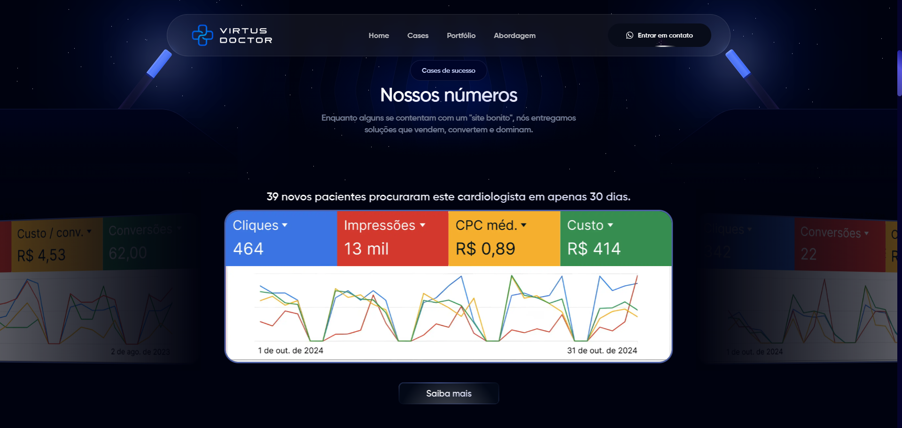
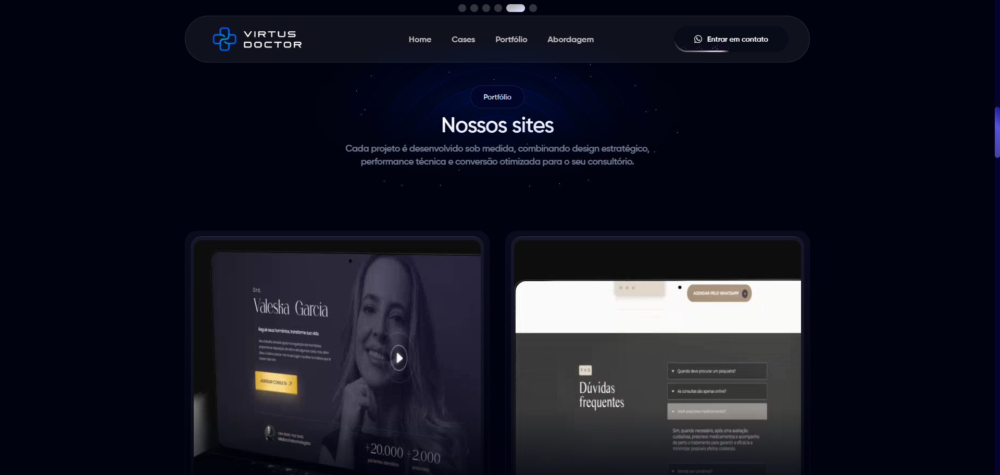
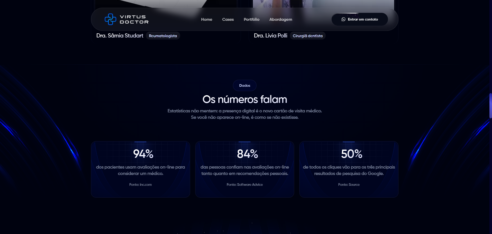
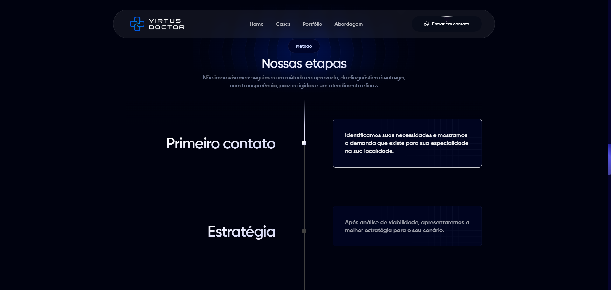
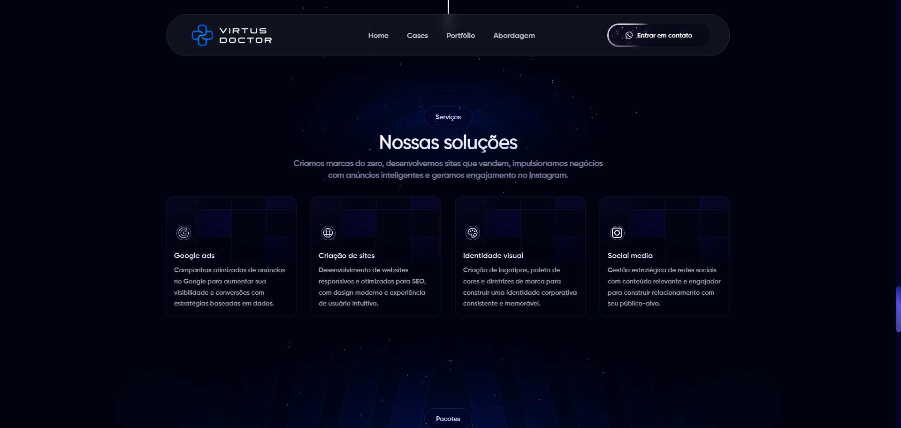
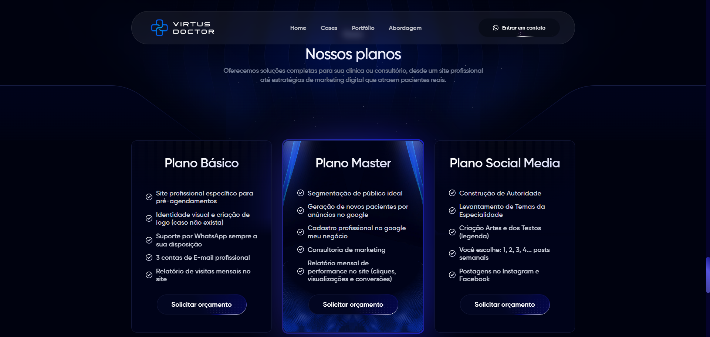
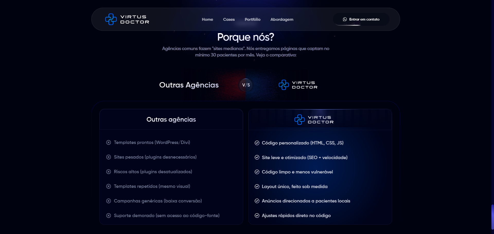
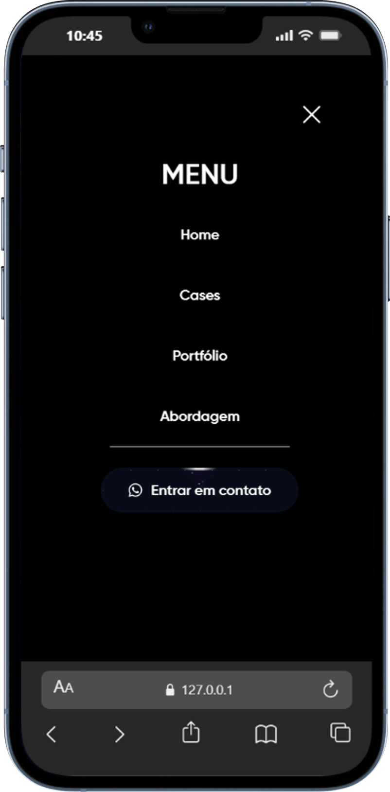

# Virtus Doctor - Landing Page

## 📸 Visualização do Projeto

Abaixo estão as prévias das principais seções da Landing Page.

### 1. Hero Section (Início)


### 2. Cases de Sucesso (Slider)


### 3. Portfólio (Vídeos)


### 4. Dados


### 5. Timeline


### 6. Soluções


### 7. Planos


### 8. Porque nós?


### 📱 Visualização Mobile
<div style="display: flex; gap: 10px;">
  
  
</div>

---

## 💻 Sobre o Projeto

Esta é uma Landing Page de alta conversão desenvolvida para a **Virtus Doctor**, agência especializada em marketing médico. O objetivo da página é captar leads (médicos e clínicas) interessados em aumentar sua presença digital.

A aplicação é uma **Single Page Application (SPA)** estática, focada em:
- **Performance:** Carregamento rápido e código limpo.
- **Conversão:** CTAs estratégicos direcionando para o WhatsApp.
- **Rastreamento:** Estrutura pronta para campanhas de tráfego pago (Google/Meta).

## 🚀 Funcionalidades Principais

- **Preloader Personalizado:** Animação de entrada enquanto os assets carregam.
- **Design Responsivo:** Layout fluido que se adapta perfeitamente a qualquer tela.
- **Carrossel Interativo:** Uso do **Swiper.js** para apresentar provas sociais.
- **Vídeo Cards:** Portfólio com autoplay ao passar o mouse (desktop) ou visível (mobile).
- **Integração com Analytics:** GTM e Meta Pixel configurados no `<head>`.
- **Efeitos Visuais:** Animações de brilho, gradientes e elementos flutuantes (estrelas/luzes).

## 🛠 Tecnologias Utilizadas

- **HTML5:** Estrutura semântica.
- **CSS3:** Animações (`@keyframes`), Flexbox, Grid e Media Queries.
- **JavaScript:** Manipulação de DOM, lógica do menu mobile e preloader.
- **Swiper.js:** Biblioteca de slider touch-friendly.

## 📂 Estrutura de Arquivos

```text
/
├── images/                 # Diretório de imagens (webp, svg, logos)
├── screenshots/            # Prints das telas usados neste README
├── videos/                 # Vídeos de demonstração (cases de sucesso)
├── .gitignore              # Arquivos ignorados pelo Git
├── app.js                  # Lógica principal (menu mobile, preloader)
├── favicon.ico             # Ícone da aba do navegador
├── Gilroy-SemiBold.ttf     # Fonte tipográfica local
├── index.html              # Estrutura HTML da Landing Page
├── readme.md               # Documentação do projeto
├── style.css               # Folha de estilos principal (CSS)
├── swiper-bundle.min.css   # Estilização do slider (biblioteca)
└── swiper-bundle.min.js    # Script do slider (biblioteca)